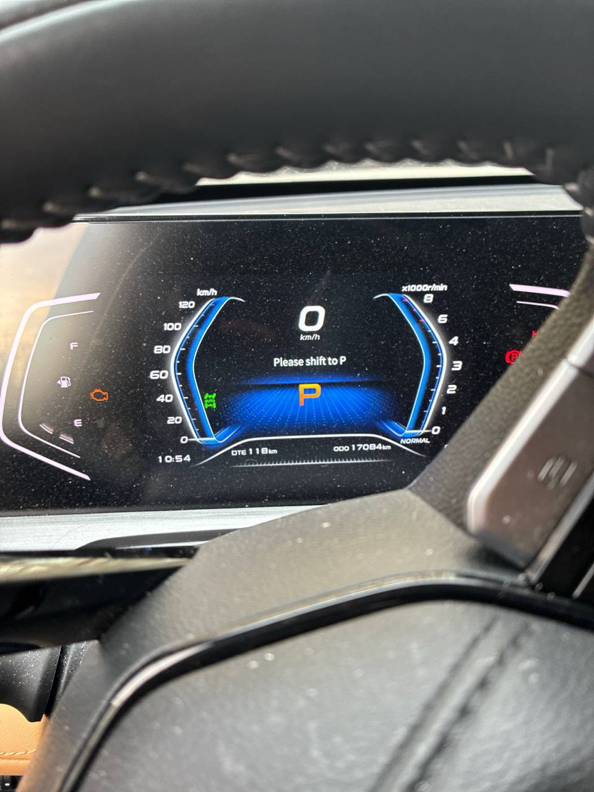

# Часто задаваемые вопросы

## Проблемы с электроникой и системами

### Не отключается паркинг (P)

**Проблема**: После остановки автомобиля не удается выключить режим паркинга (P). Автомобиль остается заблокированным в положении P, и переключение на другие режимы (R, N, D) невозможно.

**Решение**:

1. **Без нажатия на тормоз** включите зажигание, нажав один раз на кнопку "Старт/Стоп".
2. **Без нажатия на тормоз** нажмите и удерживайте кнопку "Старт/Стоп" в течение 20-30 секунд.
3. Автомобиль должен автоматически перейти в режим паркинга (P) и после этого завестись.

**Примечание**: Эта процедура является аварийным сбросом системы управления трансмиссией и может потребоваться при сбоях в электронике. Если проблема повторяется регулярно, рекомендуется провести диагностику в сервисном центре.

**Профилактика**:

- Регулярно обновляйте программное обеспечение электронных систем
- Избегайте резких переключений режимов при движении
- При длительной стоянке используйте ручной тормоз в дополнение к автоматическому паркингу

## Правила эксплуатации и обслуживания

### Правила заправки на АЗС

**Важные правила для безопасной и правильной заправки топлива:**

1. **Заливать топливо только на заглушенном двигателе** - перед заправкой обязательно заглушите двигатель. Это предотвращает риск возгорания и обеспечивает безопасность на заправочной станции.

2. **После отсечки не "цедить"** - когда автоматическая отсечка срабатывает (пистолет щелкает), не пытайтесь долить топливо "под завязку". Это может привести к:
   - Переливу топлива
   - Повреждению системы улавливания паров (EVAP)
   - Загрязнению окружающей среды
   - Некорректной работе датчика уровня топлива

**Дополнительные рекомендации**:
- Используйте только рекомендованные марки топлива (обычно АИ-95 или дизель в зависимости от двигателя)
- При заправке дизельным топливом в холодное время года используйте зимние или арктические сорта
- Регулярно проверяйте герметичность топливной системы
- Следите за состоянием топливного фильтра

## Скрытые функции и сервисные режимы

### Сервисный режим стеклоочистителей

**Для активации сервисного режима стеклоочистителей (режим обслуживания) выполните следующие действия:**

1. **Включите зажигание** (без запуска двигателя)
2. **Переведите рычаг стеклоочистителя вверх до упора один раз** (включите однократное движение щеток)
3. **Установите рычаг в режим "АВТО"** (автоматический режим работы)
4. **Выполните последовательность переключений скорости**:
   - **Вниз**: 1 → 2 → 3 (переключите через все три положения скорости вниз)
   - **Вверх**: 3 → 2 → 1 (вернитесь обратно через те же три положения вверх)

**Результат**: Стеклоочистители должны подняться и остановиться в вертикальном положении (режим обслуживания), что позволяет:
- Легко заменить щетки стеклоочистителей
- Поднять щетки для очистки лобового стекла
- Предотвратить примерзание щеток к стеклу в зимнее время

**Важное примечание**: 
- **Не с первого раза получается бывает** - если режим не активировался с первой попытки, повторите последовательность еще раз
- Убедитесь, что зажигание включено, но двигатель не запущен
- После завершения обслуживания выключите зажигание, и щетки вернутся в исходное положение
