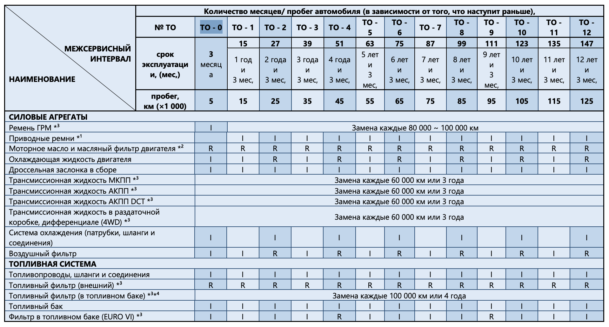
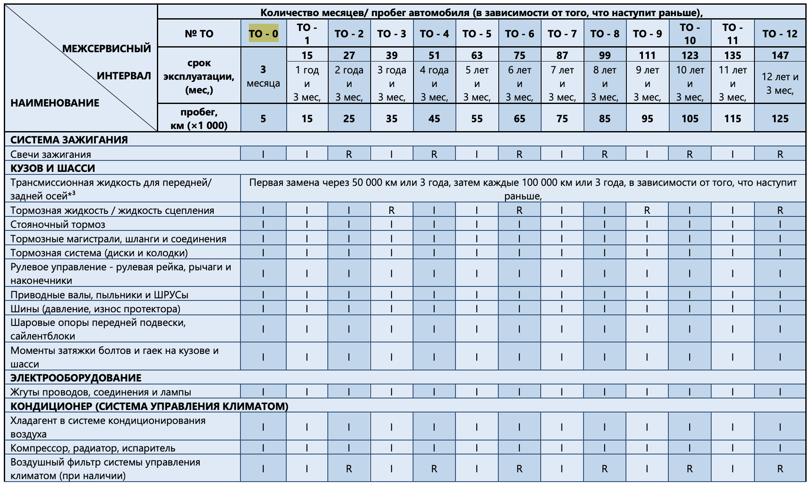

# Регламент ТО

Регулярное техническое обслуживание (ТО) — основа долговечности и безотказной работы Changan Hunter Plus. В этом разделе приведен подробный график обслуживания по пробегу и времени согласно официальному регламенту.

## Общие принципы

1. **Периодичность ТО** определяется по пробегу **или** времени — что наступит раньше.
2. **Интервал обслуживания** после ТО-0 составляет **10 000 км или 12 месяцев**.
3. **Тяжелые условия эксплуатации** (бездорожье, буксировка, городской режим с частыми остановками) сокращают интервалы на 20–30%.
4. **Контрольные осмотры** рекомендуется проводить каждые 5 000 км или перед длительными поездками.

## График технического обслуживания

### TO-0 (5 000 км или 3 месяца)

**Первое ТО после обкатки:**

- Замена моторного масла и масляного фильтра двигателя
- Замена внешнего топливного фильтра
- Проверка ремня ГРМ
- Проверка охлаждающей жидкости двигателя
- Проверка дроссельной заслонки в сборе
- Проверка системы охлаждения (патрубки, шланги и соединения)
- Проверка воздушного фильтра
- Проверка топливопроводов и топливного бака
- Проверка фильтра в топливном баке (EURO VI)

### TO-1 (15 000 км или 1 год 3 месяца)

- Замена моторного масла и масляного фильтра двигателя
- Замена внешнего топливного фильтра
- Проверка приводных ремней
- Проверка охлаждающей жидкости двигателя
- Проверка дроссельной заслонки
- Проверка воздушного фильтра
- Проверка топливопроводов, бака и фильтра в баке

### TO-2 (25 000 км или 2 года 3 месяца)

- Замена моторного масла и масляного фильтра двигателя
- Замена внешнего топливного фильтра
- **Замена охлаждающей жидкости двигателя**
- **Замена воздушного фильтра**
- Проверка приводных ремней, дроссельной заслонки
- Проверка системы охлаждения (патрубки, шланги)
- Проверка топливной системы

### TO-3 (35 000 км или 3 года 3 месяца)

- Замена моторного масла и масляного фильтра двигателя
- Замена внешнего топливного фильтра
- Проверка приводных ремней, охлаждающей жидкости, дроссельной заслонки
- Проверка воздушного фильтра
- Проверка топливной системы

### TO-4 (45 000 км или 4 года 3 месяца)

- Замена моторного масла и масляного фильтра двигателя
- Замена внешнего топливного фильтра
- **Замена охлаждающей жидкости двигателя**
- **Замена воздушного фильтра**
- **Замена фильтра в топливном баке (для EURO VI)**
- Проверка приводных ремней, дроссельной заслонки
- Проверка системы охлаждения (патрубки, шланги)
- Проверка топливопроводов и бака

### TO-5 (55 000 км или 5 лет 3 месяца)

- Замена моторного масла и масляного фильтра двигателя
- Замена внешнего топливного фильтра
- Проверка приводных ремней, охлаждающей жидкости, дроссельной заслонки, воздушного фильтра
- Проверка топливной системы
- **Примечание:** На 60 000 км или 3 года рекомендуется замена трансмиссионной жидкости (МКПП, АКПП, DCT, раздатка, дифференциалы).

### Регулярные замены по пробегу/времени

- **Ремень ГРМ:** Замена каждые 80 000 – 100 000 км.
- **Трансмиссионные жидкости:** Замена каждые 60 000 км или 3 года (МКПП, АКПП, DCT, раздаточная коробка, дифференциалы 4WD).
- **Топливный фильтр (в баке):** Замена каждые 100 000 км или 4 года.
- **Охлаждающая жидкость и воздушный фильтр:** Замена каждые 20 000 км (начиная с 25 000 км / TO-2).

## Таблица периодичности ТО (основные операции)

| № ТО | Пробег (км) | Срок (мес) | Масло ДВС | Возд. фильтр | Топл. фильтр (внеш) | Охл. жидкость |
|:----:|:-----------:|:----------:|:---------:|:------------:|:-------------------:|:-------------:|
| **TO-0** | 5 000 | 3 | R | I | R | I |
| **TO-1** | 15 000 | 15 | R | I | R | I |
| **TO-2** | 25 000 | 27 | R | **R** | R | **R** |
| **TO-3** | 35 000 | 39 | R | I | R | I |
| **TO-4** | 45 000 | 51 | R | **R** | R | **R** |
| **TO-5** | 55 000 | 63 | R | I | R | I |
| **TO-6** | 65 000 | 75 | R | **R** | R | **R** |

**Условные обозначения:**

- **R** — Замена (Replace)
- **I** — Проверка (Inspect), очистка, регулировка или замена при необходимости

## Сезонное обслуживание

### Подготовка к зиме (октябрь-ноябрь)

- Замена омывающей жидкости на зимнюю (-25°C и ниже)
- Проверка состояния аккумулятора и клемм
- Проверка системы отопления и кондиционирования
- Осмотр состояния шин, при необходимости — замена на зимние
- Обработка уплотнителей дверей силиконовой смазкой

### Подготовка к лету (апрель-май)

- Замена омывающей жидкости на летнюю
- Проверка работы системы кондиционирования
- Очистка радиаторов от насекомых и грязи
- Осмотр состояния шин, замена на летние

---
*Данный регламент основан на официальной документации Changan. Всегда сверяйтесь с сервисной книжкой вашего автомобиля.*
